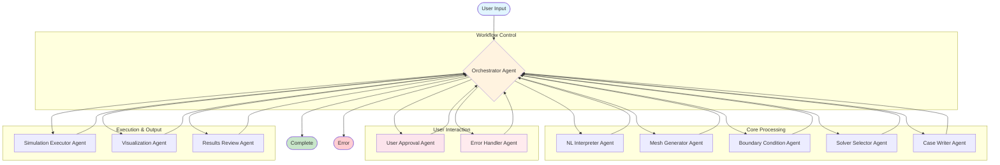
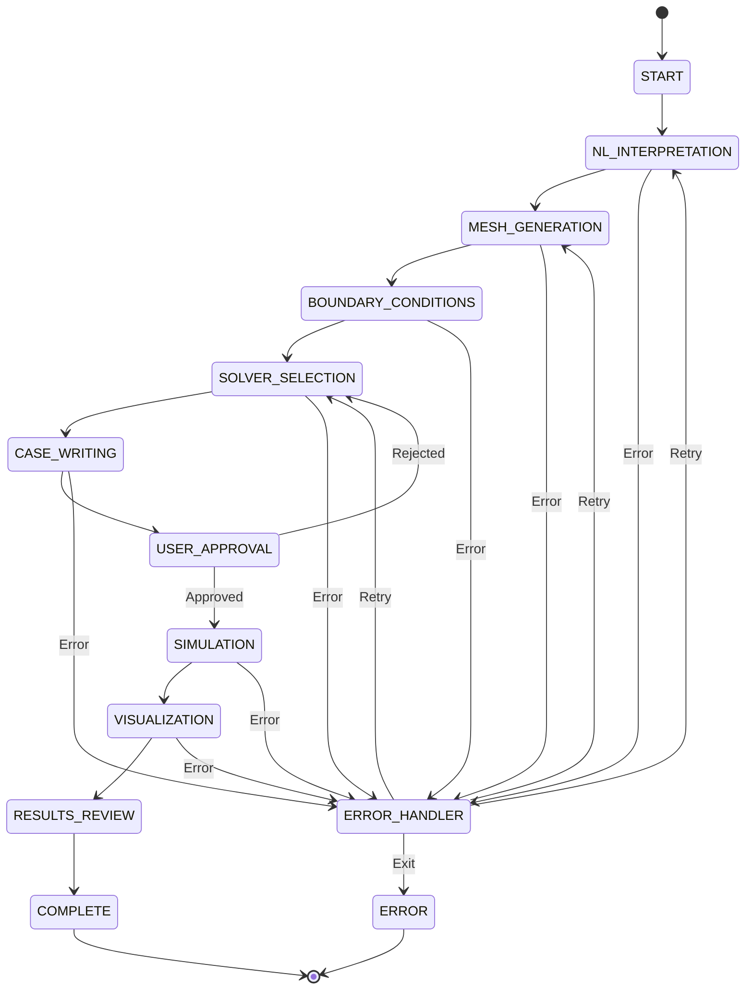
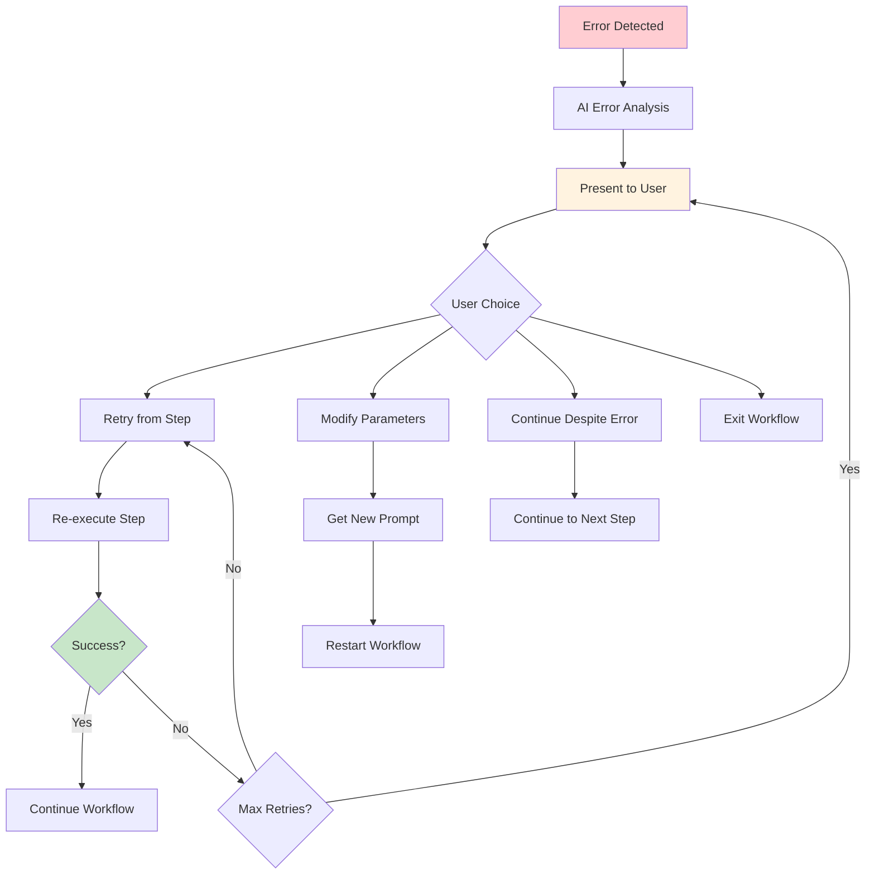

# FoamAI LangGraph Agent System Documentation

The FoamAI system uses **LangGraph** to orchestrate a sophisticated multi-agent workflow for automated CFD simulation setup and execution. This document describes the agent architecture, workflow, and output formats.

## Table of Contents
- [Overview](#overview)
- [LangGraph Workflow Architecture](#langgraph-workflow-architecture)
- [Agent Descriptions](#agent-descriptions)
- [State Management](#state-management)
- [Output Formats](#output-formats)
- [Error Handling & Recovery](#error-handling--recovery)
- [Integration Points](#integration-points)

## Overview

The FoamAI agent system transforms natural language CFD requests into complete OpenFOAM simulations through a coordinated workflow of specialized AI agents. Each agent focuses on a specific aspect of CFD setup, from natural language interpretation to mesh generation, boundary conditions, solver selection, and visualization.

### Key Features
- **Natural Language Understanding**: Parse complex CFD scenarios from user descriptions
- **Intelligent Defaults**: Apply physics-based defaults when information is missing
- **User Approval Workflow**: Pause for user validation before expensive computations
- **Error Recovery**: AI-powered error analysis and recovery suggestions
- **Multi-Modal Support**: Handle both text descriptions and STL geometries
- **Remote Execution**: Support for both local and remote OpenFOAM servers

## LangGraph Workflow Architecture



### Workflow Steps

| Step | Agent | Purpose | Output |
|------|-------|---------|--------|
| 1 | **NL Interpreter** | Parse natural language into CFD parameters | Structured parameters, geometry info |
| 2 | **Mesh Generator** | Create mesh configuration for geometry | Mesh config, quality metrics |
| 3 | **Boundary Condition** | Set up boundary conditions for physics | Boundary condition definitions |
| 4 | **Solver Selector** | Choose appropriate OpenFOAM solver | Solver settings, numerical schemes |
| 5 | **Case Writer** | Generate complete OpenFOAM case | Complete case directory structure |
| 6 | **User Approval** | Present configuration for user validation | User approval/rejection + feedback |
| 7 | **Simulation Executor** | Run OpenFOAM simulation | Simulation results, convergence data |
| 8 | **Visualization** | Generate visualization outputs | Images, ParaView files |
| 9 | **Results Review** | Analyze and present results | Summary report, recommendations |

## Agent Descriptions

### 1. Orchestrator Agent
**File**: `orchestrator.py`  
**Role**: Central workflow controller and state manager

**Responsibilities**:
- Route workflow between agents based on current state
- Handle error recovery and retry logic
- Manage user approval workflow pausing/resuming
- Quality checks and refinement decisions
- Workflow progression logic

**Key Functions**:
```python
def orchestrator_agent(state: CFDState) -> CFDState
def determine_next_agent(state: CFDState) -> str
def handle_normal_progression(state: CFDState) -> CFDState
def approve_configuration_and_continue(state: CFDState) -> CFDState
```

**Output Format**:
```python
{
    "current_step": CFDStep,
    "retry_count": int,
    "awaiting_user_approval": bool,
    "workflow_paused": bool,
    "config_summary": dict  # For UI display
}
```

### 2. Natural Language Interpreter Agent
**File**: `nl_interpreter.py`  
**Role**: Parse user prompts into structured CFD parameters

**Responsibilities**:
- Extract geometry type and dimensions from text
- Identify flow conditions and fluid properties
- Detect analysis type (steady/unsteady, laminar/turbulent)
- Parse boundary conditions and solver preferences
- Handle STL file integration
- Validate extracted parameters

**LLM Integration**:
- **Model**: GPT-4o-mini for fast response
- **Temperature**: 0.1 for consistent parsing
- **Output Parser**: Pydantic for structured data

**Key Functions**:
```python
def nl_interpreter_agent(state: CFDState) -> CFDState
def extract_dimensions_from_text(text: str, geometry_type: GeometryType) -> Dict[str, float]
def detect_advanced_parameters(prompt: str) -> Dict[str, Any]
def validate_physical_parameters(parsed_params: Dict[str, Any]) -> List[Dict[str, Any]]
```

**Output Format**:
```python
{
    "parsed_parameters": {
        "geometry_type": GeometryType,
        "geometry_dimensions": Dict[str, float],
        "flow_type": FlowType,
        "analysis_type": AnalysisType,
        "velocity": float,
        "reynolds_number": float,
        "solver_type": str,
        "mesh_resolution": str,
        "simulation_time": float,
        "is_multiphase": bool,
        "phases": List[str],
        "gpu_info": Dict[str, Any]
    },
    "geometry_info": {
        "type": GeometryType,
        "dimensions": Dict[str, float],
        "flow_context": {
            "is_external_flow": bool,
            "domain_type": str,
            "domain_size_multiplier": float
        },
        "is_custom_geometry": bool,
        "stl_file": str
    }
}
```

### 3. Mesh Generator Agent
**File**: `mesh_generator.py`  
**Role**: Create OpenFOAM mesh configurations

**Responsibilities**:
- Generate geometry-specific mesh configurations
- Handle both blockMesh and snappyHexMesh approaches
- Support custom STL geometries
- Calculate mesh quality estimates
- Optimize cell count vs. accuracy trade-offs

**Supported Geometries**:
- **Cylinder**: O-grid or snappyHexMesh with boundary layers
- **Airfoil**: C-grid or snappyHexMesh with high surface refinement
- **Sphere**: 3D snappyHexMesh with curved surface handling
- **Cube**: Cartesian refinement with wake capture
- **Pipe**: Structured cylindrical mesh
- **Channel**: Structured rectangular mesh
- **Nozzle**: snappyHexMesh with STL generation
- **Custom STL**: snappyHexMesh with automatic refinement

**Key Functions**:
```python
def mesh_generator_agent(state: CFDState) -> CFDState
def generate_mesh_config(geometry_info: Dict[str, Any], parsed_params: Dict[str, Any]) -> Dict[str, Any]
def generate_stl_mesh_config(stl_file: str, mesh_resolution: str, flow_context: Dict[str, Any]) -> Dict[str, Any]
def validate_mesh_config(mesh_config: Dict[str, Any]) -> Dict[str, Any]
```

**Output Format**:
```python
{
    "mesh_config": {
        "type": "snappyHexMesh" | "blockMesh",
        "mesh_topology": str,
        "geometry_type": str,
        "is_external_flow": bool,
        "is_2d": bool,
        "is_custom_geometry": bool,
        "stl_file": str,
        "background_mesh": {
            "domain_length": float,
            "domain_height": float,
            "domain_width": float,
            "n_cells_x": int,
            "n_cells_y": int,
            "n_cells_z": int
        },
        "snappy_settings": {
            "castellated_mesh": bool,
            "snap": bool,
            "add_layers": bool,
            "refinement_levels": Dict[str, int],
            "location_in_mesh": List[float]
        },
        "dimensions": Dict[str, float],
        "total_cells": int
    },
    "mesh_quality": {
        "quality_score": float,
        "estimated_memory": float,
        "estimated_time": float,
        "recommendations": List[str]
    }
}
```

### 4. Boundary Condition Agent
**File**: `boundary_condition.py`  
**Role**: Set up physics-appropriate boundary conditions

**Responsibilities**:
- Generate OpenFOAM boundary condition files (0/ directory)
- Handle different flow regimes (laminar/turbulent)
- Set up multiphase flow conditions
- Configure turbulence parameters
- Handle rotating reference frames

**Boundary Types**:
- **Inlet**: fixedValue velocity, zeroGradient pressure
- **Outlet**: zeroGradient velocity, fixedValue pressure
- **Walls**: noSlip velocity, zeroGradient pressure
- **Symmetry**: symmetryPlane for all fields
- **Atmosphere**: Multiphase phase fraction

**Key Functions**:
```python
def boundary_condition_agent(state: CFDState) -> CFDState
def generate_boundary_conditions(parsed_params: Dict[str, Any], geometry_info: Dict[str, Any]) -> Dict[str, Any]
def setup_turbulence_parameters(flow_type: FlowType, reynolds_number: float) -> Dict[str, Any]
def handle_multiphase_boundaries(phases: List[str], geometry_info: Dict[str, Any]) -> Dict[str, Any]
```

**Output Format**:
```python
{
    "boundary_conditions": {
        "U": {
            "inlet": {"type": "fixedValue", "value": "uniform (1 0 0)"},
            "outlet": {"type": "zeroGradient"},
            "walls": {"type": "fixedValue", "value": "uniform (0 0 0)"}
        },
        "p": {
            "inlet": {"type": "zeroGradient"},
            "outlet": {"type": "fixedValue", "value": "uniform 0"},
            "walls": {"type": "zeroGradient"}
        },
        "k": {...},  # Turbulence fields if turbulent
        "epsilon": {...},
        "alpha.water": {...}  # Phase fields if multiphase
    },
    "turbulence_properties": {
        "simulationType": "RAS" | "LES" | "laminar",
        "RAS": {
            "RASModel": "kEpsilon" | "kOmegaSST",
            "turbulence": "on",
            "printCoeffs": "on"
        }
    }
}
```

### 5. Solver Selector Agent
**File**: `solver_selector.py`  
**Role**: Choose appropriate OpenFOAM solver and numerical schemes

**Responsibilities**:
- Analyze flow physics to select optimal solver
- Configure numerical schemes (fvSchemes)
- Set up solution algorithms (fvSolution)
- Handle time stepping for transient cases
- GPU acceleration configuration

**Solver Selection Logic**:
```python
# Compressible flow detection
if mach_number > 0.3 or "supersonic" in prompt:
    solver = "rhoPimpleFoam"  # Compressible transient
    
# Multiphase flow detection  
elif is_multiphase:
    solver = "interFoam"  # VOF method
    
# Heat transfer detection
elif has_heat_transfer:
    solver = "chtMultiRegionFoam"  # Conjugate heat transfer
    
# Standard incompressible flow
elif analysis_type == "steady":
    solver = "simpleFoam"  # Steady-state SIMPLE
else:
    solver = "pimpleFoam"  # Transient PIMPLE
```

**Key Functions**:
```python
def solver_selector_agent(state: CFDState) -> CFDState
def detect_physics_requirements(parsed_params: Dict[str, Any]) -> Dict[str, Any]
def select_solver_with_ai(user_prompt: str, physics_analysis: Dict[str, Any]) -> str
def configure_numerical_schemes(solver: str, flow_type: FlowType) -> Dict[str, Any]
```

**Output Format**:
```python
{
    "solver_settings": {
        "solver": "pimpleFoam",
        "end_time": 1.0,
        "time_step": 0.001,
        "write_control": "adjustableRunTime",
        "write_interval": 0.1,
        "max_co": 0.5,
        "max_alpha_co": 1.0,
        "max_dt": 0.01
    },
    "fv_schemes": {
        "ddtSchemes": {"default": "Euler"},
        "gradSchemes": {"default": "Gauss linear"},
        "divSchemes": {
            "default": "none",
            "div(phi,U)": "Gauss linearUpwind grad(U)",
            "div(phi,k)": "Gauss upwind",
            "div(phi,epsilon)": "Gauss upwind"
        },
        "laplacianSchemes": {"default": "Gauss linear orthogonal"},
        "interpolationSchemes": {"default": "linear"},
        "snGradSchemes": {"default": "orthogonal"}
    },
    "fv_solution": {
        "solvers": {
            "p": {"solver": "GAMG", "tolerance": 1e-6},
            "U": {"solver": "smoothSolver", "tolerance": 1e-7},
            "k": {"solver": "smoothSolver", "tolerance": 1e-7},
            "epsilon": {"solver": "smoothSolver", "tolerance": 1e-7}
        },
        "PIMPLE": {
            "nOuterCorrectors": 1,
            "nCorrectors": 2,
            "nNonOrthogonalCorrectors": 1,
            "residualControl": {"U": 1e-6, "p": 5e-4}
        }
    }
}
```

### 6. Case Writer Agent
**File**: `case_writer.py`  
**Role**: Generate complete OpenFOAM case directory structure

**Responsibilities**:
- Create all OpenFOAM case files and directories
- Write mesh generation scripts (blockMeshDict, snappyHexMeshDict)
- Generate solver control files (controlDict, fvSchemes, fvSolution)
- Set up initial and boundary conditions
- Handle STL file copying and processing

**Generated Files**:
```
case_directory/
├── 0/                          # Initial and boundary conditions
│   ├── U, p, k, epsilon       # Flow fields
│   └── alpha.water            # Phase fields (if multiphase)
├── constant/
│   ├── polyMesh/              # Mesh (generated later)
│   ├── transportProperties    # Fluid properties
│   ├── turbulenceProperties   # Turbulence model
│   └── g                      # Gravity (if needed)
├── system/
│   ├── controlDict           # Simulation control
│   ├── fvSchemes             # Numerical schemes
│   ├── fvSolution            # Solution algorithms
│   ├── blockMeshDict         # Mesh generation (if blockMesh)
│   ├── snappyHexMeshDict     # Mesh generation (if snappyHexMesh)
│   └── decomposeParDict      # Parallel decomposition
└── constant/triSurface/       # STL files (if needed)
    └── geometry.stl
```

**Key Functions**:
```python
def case_writer_agent(state: CFDState) -> CFDState
def create_openfoam_case(case_directory: str, mesh_config: Dict, boundary_conditions: Dict, solver_settings: Dict) -> Dict[str, Any]
def write_mesh_generation_files(case_dir: str, mesh_config: Dict) -> None
def setup_parallel_decomposition(case_dir: str, n_processors: int) -> None
```

**Output Format**:
```python
{
    "case_directory": "/path/to/case",
    "work_directory": "/path/to/work",
    "files_created": [
        "0/U", "0/p", "0/k", "0/epsilon",
        "constant/transportProperties",
        "system/controlDict", "system/fvSchemes", "system/fvSolution",
        "system/blockMeshDict"
    ],
    "mesh_commands": [
        "blockMesh",
        "checkMesh"
    ],
    "solver_command": "pimpleFoam",
    "parallel_setup": {
        "enabled": bool,
        "processors": int,
        "decomposition_method": str
    }
}
```

### 7. User Approval Agent
**File**: `user_approval.py`  
**Role**: Present configuration for user validation

**Responsibilities**:
- Create configuration summary for UI display
- Handle user approval/rejection workflow
- Process user feedback for configuration changes
- Generate ParaView-ready case information

**Key Functions**:
```python
def user_approval_agent(state: CFDState) -> CFDState
def create_config_summary(state: CFDState) -> Dict[str, Any]
def handle_user_feedback(feedback: str, state: CFDState) -> CFDState
```

**Output Format**:
```python
{
    "config_summary": {
        "mesh_info": {
            "mesh_type": str,
            "total_cells": int,
            "quality_score": float
        },
        "solver_info": {
            "solver_name": str,
            "end_time": float,
            "time_step": float
        },
        "simulation_parameters": {
            "flow_type": str,
            "analysis_type": str,
            "velocity": float,
            "reynolds_number": float
        },
        "case_info": {
            "case_directory": str,
            "foam_file_path": str
        },
        "ai_explanation": str
    },
    "awaiting_user_approval": bool,
    "workflow_paused": bool
}
```

### 8. Simulation Executor Agent
**File**: `simulation_executor.py`  
**Role**: Execute OpenFOAM simulation

**Responsibilities**:
- Run mesh generation (blockMesh/snappyHexMesh)
- Execute OpenFOAM solver
- Monitor convergence and progress
- Handle parallel execution
- Parse solver output and residuals

**Execution Modes**:
- **Local**: Direct execution on local machine
- **Remote**: Execution on remote OpenFOAM server via API
- **GPU**: Accelerated execution with PETSc/AmgX

**Key Functions**:
```python
def simulation_executor_agent(state: CFDState) -> CFDState
def run_openfoam_simulation(case_directory: str, solver: str, parallel: bool) -> Dict[str, Any]
def monitor_convergence(case_directory: str) -> Dict[str, Any]
def parse_solver_output(log_file: str) -> Dict[str, Any]
```

**Output Format**:
```python
{
    "simulation_results": {
        "success": bool,
        "solver_output": str,
        "execution_time": float,
        "mesh_generation": {
            "success": bool,
            "total_cells": int,
            "mesh_quality": Dict[str, float]
        },
        "solver_execution": {
            "success": bool,
            "iterations": int,
            "final_time": float,
            "convergence_achieved": bool
        }
    },
    "convergence_metrics": {
        "converged": bool,
        "final_residuals": {
            "U": float,
            "p": float,
            "k": float,
            "epsilon": float
        },
        "iteration_count": int
    }
}
```

### 9. Visualization Agent
**File**: `visualization.py`  
**Role**: Generate visualization outputs

**Responsibilities**:
- Create ParaView visualization scripts
- Generate standard flow visualizations
- Export images and animations
- Set up ParaView server integration

**Visualization Types**:
- **Pressure Fields**: Contour plots with color maps
- **Velocity Fields**: Vector plots and streamlines
- **Turbulence**: k, epsilon, or omega field visualizations
- **Multiphase**: Phase fraction and interface tracking
- **Custom**: User-specified field visualizations

**Key Functions**:
```python
def visualization_agent(state: CFDState) -> CFDState
def create_paraview_script(case_directory: str, visualization_config: Dict) -> str
def generate_standard_plots(case_directory: str, solver_results: Dict) -> List[str]
def export_visualization_data(case_directory: str) -> Dict[str, Any]
```

**Output Format**:
```python
{
    "visualization_path": "/path/to/visualizations",
    "generated_images": [
        "pressure_field.png",
        "velocity_vectors.png", 
        "streamlines.png"
    ],
    "paraview_files": [
        "case.foam",
        "visualization_script.py"
    ],
    "paraview_server": {
        "status": "running",
        "port": 11111,
        "connection_string": "localhost:11111"
    }
}
```

### 10. Results Review Agent
**File**: `results_review.py`  
**Role**: Analyze and present simulation results

**Responsibilities**:
- Extract key simulation metrics
- Validate results against physics expectations
- Generate summary reports
- Provide recommendations for improvements

**Key Functions**:
```python
def results_review_agent(state: CFDState) -> CFDState
def extract_simulation_metrics(simulation_results: Dict, convergence_metrics: Dict) -> Dict[str, Any]
def validate_results_physics(metrics: Dict, parsed_params: Dict) -> Dict[str, Any]
def generate_summary_report(state: CFDState) -> str
```

**Output Format**:
```python
{
    "results_summary": {
        "simulation_successful": bool,
        "key_metrics": {
            "pressure_drop": float,
            "drag_coefficient": float,
            "heat_transfer_rate": float,
            "mass_flow_rate": float
        },
        "quality_assessment": {
            "mesh_quality": str,
            "convergence_quality": str,
            "physics_validation": str
        },
        "recommendations": List[str]
    }
}
```

### 11. Error Handler Agent
**File**: `error_handler.py`  
**Role**: AI-powered error analysis and recovery

**Responsibilities**:
- Analyze OpenFOAM and system errors
- Provide user-friendly error explanations
- Suggest specific recovery actions
- Guide users through error resolution

**Key Functions**:
```python
def error_handler_agent(state: CFDState) -> CFDState
def get_ai_error_analysis(error_message: str, state: CFDState) -> Dict[str, Any]
def prompt_for_error_recovery(state: CFDState, error_analysis: Dict) -> str
def determine_recovery_step(error: str, state: CFDState) -> CFDStep
```

**Output Format**:
```python
{
    "error_analysis": {
        "error_category": str,
        "user_explanation": str,
        "technical_details": str,
        "suggested_fixes": List[str],
        "recovery_options": List[str]
    },
    "recovery_action": "retry" | "modify" | "continue" | "exit"
}
```

## State Management

The workflow uses a comprehensive `CFDState` TypedDict that flows between all agents:

```python
class CFDState(TypedDict):
    # User input
    user_prompt: str
    stl_file: Optional[str]
    
    # Parsed parameters
    parsed_parameters: Dict[str, Any]
    geometry_info: Dict[str, Any]
    
    # Agent outputs
    mesh_config: Dict[str, Any]
    boundary_conditions: Dict[str, Any]
    solver_settings: Dict[str, Any]
    
    # File paths
    case_directory: str
    work_directory: str
    
    # Results
    simulation_results: Dict[str, Any]
    visualization_path: str
    
    # Error handling
    errors: List[str]
    warnings: List[str]
    
    # Workflow control
    current_step: CFDStep
    retry_count: int
    max_retries: int
    user_approved: bool
    awaiting_user_approval: bool
    workflow_paused: bool
    
    # Quality metrics
    mesh_quality: Optional[Dict[str, Any]]
    convergence_metrics: Optional[Dict[str, Any]]
    
    # Configuration
    verbose: bool
    export_images: bool
    execution_mode: str  # "local" or "remote"
    server_url: Optional[str]
    project_name: Optional[str]
```

### State Transitions



## Output Formats

### Standard Workflow Output

Each successful workflow execution produces:

```python
{
    "status": "success",
    "execution_time": float,
    "workflow_summary": {
        "user_prompt": str,
        "geometry_type": str,
        "solver_used": str,
        "total_cells": int,
        "simulation_time": float
    },
    "files_generated": {
        "case_directory": str,
        "visualization_images": List[str],
        "paraview_files": List[str],
        "log_files": List[str]
    },
    "results": {
        "converged": bool,
        "key_metrics": Dict[str, float],
        "recommendations": List[str]
    },
    "paraview_info": {
        "server_port": int,
        "connection_string": str,
        "foam_file": str
    }
}
```

### Configuration Summary (for UI)

```python
{
    "mesh_info": {
        "mesh_type": str,
        "total_cells": int,
        "quality_score": float,
        "aspect_ratio": float
    },
    "solver_info": {
        "solver_name": str,
        "end_time": float,
        "time_step": float,
        "write_control": str,
        "write_interval": float
    },
    "simulation_parameters": {
        "flow_type": str,
        "analysis_type": str,
        "velocity": float,
        "reynolds_number": float,
        "geometry_type": str
    },
    "boundary_conditions": Dict[str, Any],
    "case_info": {
        "case_directory": str,
        "project_name": str,
        "foam_file_path": str
    },
    "ai_explanation": str
}
```

## Error Handling & Recovery

### Error Categories

| Category | Description | Recovery Actions |
|----------|-------------|------------------|
| **Validation** | Parameter validation failures | Modify parameters, use defaults |
| **Mesh Generation** | blockMesh/snappyHexMesh failures | Adjust mesh settings, simplify geometry |
| **Solver** | OpenFOAM solver crashes/divergence | Change solver, adjust time step, modify schemes |
| **Convergence** | Poor or no convergence | Refine mesh, adjust relaxation factors |
| **System** | File I/O, permission, resource errors | Check paths, permissions, disk space |

### Recovery Workflow



## Integration Points

### CLI Integration
```bash
# Single command execution
foamai solve "turbulent flow around a cylinder at Re=1000"

# With configuration options
foamai solve "flow in a nozzle" --mesh-resolution fine --export-images --use-gpu

# Remote execution
foamai solve "airfoil at 5 degrees" --remote --server http://server:8000 --project my-sim
```

### Desktop UI Integration
```python
# Start workflow
workflow = create_cfd_workflow()
initial_state = create_initial_state(
    user_prompt="flow around cylinder",
    user_approval_enabled=True,
    export_images=True
)

# Execute until user approval needed
final_state = None
for state in workflow.stream(initial_state):
    if state.get("awaiting_user_approval"):
        # Present config_summary to user
        display_configuration(state["config_summary"])
        break
    final_state = state

# After user approval
if user_approves:
    approved_state = approve_configuration_and_continue(state)
    # Continue execution
    for state in workflow.stream(approved_state):
        final_state = state
```

### Remote Server Integration
```python
# Configure remote execution
remote_state = create_remote_workflow_state(
    user_prompt="turbulent flow around sphere",
    server_url="http://openfoam-server:8000",
    project_name="sphere_flow_study"
)

# Execute remotely
workflow = create_cfd_workflow()
result = workflow.invoke(remote_state)

# Get ParaView server info
pvserver_info = get_remote_project_info(server_url, project_name)
```

### API Integration
The agents integrate seamlessly with the FoamAI backend API for remote execution, project management, and ParaView server orchestration. See [Backend API Documentation](BackendAPI.md) for complete API reference.

---

*This agent documentation provides the foundation for understanding and extending the FoamAI intelligent CFD workflow system. Each agent is designed to be modular and replaceable while maintaining consistent interfaces through the LangGraph state management system.*