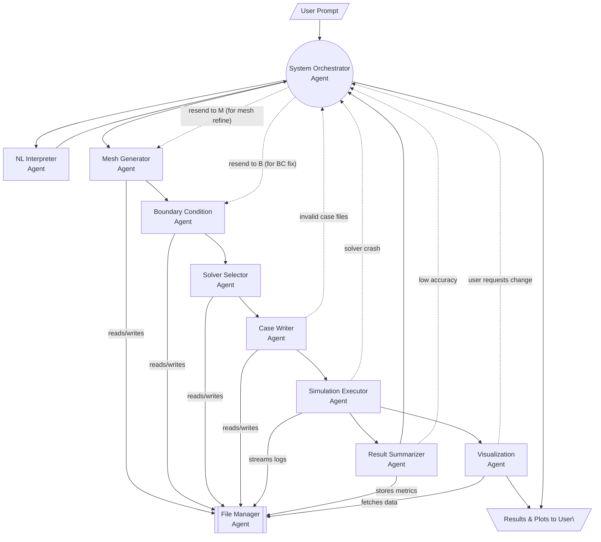

## Agent List

| Agent Name | Responsibility | Required Tools | Dependencies |
|------------|----------------|----------------|--------------|
| **1. NL Interpreter Agent** | Parse user's natural language prompt into structured CFD parameters (geometry, boundary conditions, solver settings). | LLM (OpenAI/GPT-4o), LangChain PydanticOutputParser | User input |
| **2. Mesh Generator Agent** | Generate blockMeshDict or trigger snappyHexMesh based on geometry info. | File I/O, OpenFOAM dictionary templates, Geometry helper tools (e.g. pyvista) | NL Interpreter Agent |
| **3. Boundary Condition Agent** | Populate `0/` fields (e.g., `U`, `p`) and adjust `transportProperties`, `turbulenceProperties`. | OpenFOAM dict templates, LLM (optional for fill-ins) | NL Interpreter Agent |
| **4. Solver Selector Agent** | Choose appropriate solver (e.g., `simpleFoam`, `pisoFoam`, `interFoam`) and configure `fvSchemes`, `fvSolution`. | OpenFOAM solver catalog, rule-based decision tree or LLM tool | NL Interpreter Agent |
| **5. Case Writer Agent** | Assemble full case folder from the above parts and stage it in a temporary directory. | Filesystem access, Jinja2 templates, LangChain file agent | Mesh, BC, Solver Agents |
| **6. Simulation Executor Agent** | Run OpenFOAM command-line tools and monitor residuals / time steps. | Subprocess, Docker API (or SSH if running on host), Celery | Case Writer Agent |
| **7. Result Summarizer Agent** | Extract meaningful quantities (lift, drag, pressure drop, etc.) from logs or result fields. | FoamLog parser, custom Python post-processing, numpy/pandas | Simulation Executor Agent |
| **8. Visualization Agent** | Generate and return images or session for ParaView Client (via `pvserver`). | ParaView scripting, pvpython, PyVista, presigned S3 URLs | Simulation Executor Agent |
| **9. File Manager Agent** | Handles uploads/downloads, serialization of large input/output files, and caching. | S3 API or local FS, checksum utilities | All agents |
| **10. System Orchestrator Agent** | Maintains state, logs transitions, determines next agent to trigger. | LangGraph state machine, memory store, Redis or file-based logs | All |

---

## Notes on Integration

- **LangGraph** handles branching and retry logic — e.g., if the Simulation Executor fails due to BC mismatch, it can route back to the BC Agent.
- **Tool Composition:** LangChain tools can be used inside agents for file generation, prompt templating, or OpenAI function calling.
- **Artifacts and transitions should be versioned** using structured names (e.g., `case_v2_run03`).

---

## Optional Add-ons

| Agent | Responsibility | Tools |
|-------|----------------|-------|
| **Auth Agent** | Ensure API requests are signed or token-authenticated. | OAuth2, Auth0 SDK |
| **HPC Dispatch Agent** | Offload to SLURM or remote cluster if user chooses HPC instead of VM. | SSH, SLURM CLI, job templates |
| **Fine-Tune Recommender Agent** | Suggest simulation refinements (mesh resolution, turbulence model). | LLM, domain heuristics |

