```mermaid
flowchart TD
    %% Development Phase
    A[Developer Commits Code] --> B[Push to GitHub Repository]
    B --> C{Branch Type?}
    
    %% CI/CD Branch Logic
    C -->|main/master| D[GitHub Actions Triggers]
    C -->|feature/PR| E[GitHub Actions<br/>Build Only<br/>No Deploy]
    
    %% GitHub Actions CI/CD Phase
    D --> F[Checkout Repository]
    F --> G[Set up Docker Buildx]
    G --> H[Login to GHCR<br/>ghcr.io]
    H --> I[Build Matrix Strategy<br/>3 Services Parallel]
    
    %% Service Building
    I --> J1[Build OpenFOAM<br/>docker/openfoam/]
    I --> J2[Build API<br/>docker/api/]
    I --> J3[Build ParaView Server<br/>docker/pvserver/]
    
    %% Image Publishing
    J1 --> K1[Push to GHCR<br/>ghcr.io/batuhan/foamai/openfoam:latest]
    J2 --> K2[Push to GHCR<br/>ghcr.io/batuhan/foamai/api:latest]
    J3 --> K3[Push to GHCR<br/>ghcr.io/batuhan/foamai/pvserver:latest]
    
    %% Security & Summary
    K1 --> L[Security Scan<br/>Trivy Vulnerability Check]
    K2 --> L
    K3 --> L
    L --> M[Build Summary<br/>GitHub Actions Report]
    
    %% Infrastructure Phase
    M --> N{Infrastructure<br/>Ready?}
    N -->|No| O[Deploy Infrastructure<br/>Terraform Apply]
    N -->|Yes| P[Use Existing<br/>Infrastructure]
    
    %% Terraform Infrastructure Setup
    O --> O1[Create VPC & Networking<br/>us-east-1]
    O1 --> O2[Launch EC2 Instance<br/>c7i.2xlarge Ubuntu 22.04]
    O2 --> O3[Attach EBS Volumes<br/>Root: 50GB, Data: 100GB]
    O3 --> O4[Configure Security Groups<br/>SSH:22, HTTP:80, HTTPS:443<br/>API:8000, ParaView:11111]
    O4 --> O5[Assign Elastic IP]
    O5 --> P
    
    %% EC2 Bootstrap Phase
    P --> Q[EC2 User Data Script<br/>Executes on Boot]
    Q --> Q1[Update System Packages<br/>apt-get update & upgrade]
    Q1 --> Q2[Install Docker & Docker Compose<br/>Latest Stable Versions]
    Q2 --> Q3[Setup Data Volume<br/>Mount EBS to /data]
    Q3 --> Q4[Clone Repository<br/>git clone foamai.git]
    Q4 --> Q5[Create Environment Config<br/>.env with GHCR URLs]
    Q5 --> Q6[Create systemd Service<br/>foamai.service]
    
    %% Application Deployment Phase
    Q6 --> R[Pull Docker Images<br/>from GitHub Container Registry]
    R --> R1[docker-compose pull<br/>openfoam, api, pvserver]
    R1 --> S[Start Services<br/>docker-compose up -d]
    
    %% Service Orchestration
    S --> S1[Start API Service<br/>Port 8000]
    S --> S2[Start OpenFOAM Service<br/>Compute Engine]
    S --> S3[Start ParaView Server<br/>Port 11111]
    
    %% Health Checks & Monitoring
    S1 --> T1[API Health Check<br/>curl localhost:8000/ping]
    S2 --> T2[OpenFOAM Health Check<br/>bashrc validation]
    S3 --> T3[ParaView Health Check<br/>process monitoring]
    
    %% Live System
    T1 --> U[Live Deployment Ready!]
    T2 --> U
    T3 --> U
    
    %% Operational Phase
    U --> V1[API Endpoints<br/>http://IP:8000<br/>http://IP:8000/docs]
    U --> V2[ParaView Visualization<br/>connect to IP:11111]
    U --> V3[Shared Data Volume<br/>/data for simulations]
    
    %% Status & Monitoring
    U --> W[Status Monitoring<br/>foamai-status script]
    W --> X[Log Monitoring<br/>startup & container logs]
    
    %% Update Cycle
    U --> Y{New Code<br/>Changes?}
    Y -->|Yes| A
    Y -->|No| U
    
    %% Styling
    classDef devPhase fill:#e1f5fe
    classDef ciPhase fill:#f3e5f5
    classDef infraPhase fill:#fff3e0
    classDef deployPhase fill:#e8f5e8
    classDef livePhase fill:#fff8e1
    
    class A,B,C devPhase
    class D,E,F,G,H,I,J1,J2,J3,K1,K2,K3,L,M ciPhase
    class N,O,O1,O2,O3,O4,O5,P infraPhase
    class Q,Q1,Q2,Q3,Q4,Q5,Q6,R,R1,S,S1,S2,S3,T1,T2,T3 deployPhase
    class U,V1,V2,V3,W,X,Y livePhase
```

# FoamAI Complete Deployment Workflow

This document outlines the complete deployment workflow for FoamAI, from code commits through GitHub Actions CI/CD to live AWS deployment.

## 🔄 Deployment Flow Diagram



## 📋 Deployment Phases Overview

### **Phase 1: Development & Commit** 🔨
- **Developer commits code** to the repository
- **Push to GitHub** triggers the automated pipeline
- **Branch detection** determines the deployment path:
  - `main/master` → Full CI/CD with deployment
  - `feature/PR` → Build-only for testing

### **Phase 2: GitHub Actions CI/CD Pipeline** ⚙️
- **Parallel Docker builds** for 3 services:
  - **OpenFOAM solver** (`docker/openfoam/Dockerfile`)
  - **FastAPI backend** (`docker/api/Dockerfile`) 
  - **ParaView server** (`docker/pvserver/Dockerfile`)

- **Container registry publishing**:
  - Images pushed to **GitHub Container Registry** (`ghcr.io`)
  - Tagged with `latest`, branch name, and commit SHA
  - **No Docker Hub dependency** (solved previous reliability issues)

- **Security & quality checks**:
  - **Trivy vulnerability scanning** on all images
  - **Build summary** with status reports

### **Phase 3: Infrastructure Provisioning (Terraform)** 🏗️
- **AWS Infrastructure** in `us-east-1`:
  - **VPC & networking** with public subnet
  - **EC2 instance** (`c7i.2xlarge`) with Ubuntu 22.04
  - **EBS volumes**: 50GB root + 100GB data storage
  - **Security groups**: Ports 22, 80, 443, 8000, 11111
  - **Elastic IP** for consistent public access

### **Phase 4: Automated EC2 Deployment** 🚀
- **User data script** runs on first boot:
  - **System updates** and essential package installation
  - **Docker & Docker Compose** installation
  - **Data volume setup** and mounting to `/data`
  - **Repository cloning** and environment configuration

- **Application setup**:
  - **Docker images pulled** from GitHub Container Registry
  - **systemd service** created for automatic startup
  - **Log rotation** and monitoring configured

### **Phase 5: Service Orchestration** 🎭
- **Docker Compose startup** with 3 services:
  - **API service** on port 8000 with health checks
  - **OpenFOAM service** for CFD computations
  - **ParaView server** on port 11111 for visualization

- **Health monitoring**:
  - Individual service health checks
  - Shared data volume for simulation files
  - Automatic restart policies

### **Phase 6: Live System** 🌐
- **Production endpoints**:
  - **API**: `http://[ELASTIC-IP]:8000`
  - **API Documentation**: `http://[ELASTIC-IP]:8000/docs`
  - **ParaView**: Connect to `[ELASTIC-IP]:11111`

- **Operational tools**:
  - **Status monitoring**: `sudo foamai-status` command
  - **Log monitoring**: Centralized logging and rotation
  - **Data persistence**: EBS-backed simulation storage

## 🔧 Manual Operations

### Infrastructure Deployment
```bash
# Deploy or update AWS infrastructure
cd infra
terraform plan
terraform apply
```

### Application Updates
```bash
# On EC2 instance - Update to latest images
cd /opt/foamai
docker-compose pull
docker-compose up -d
```

### Status Monitoring
```bash
# Check overall system status
sudo foamai-status

# View specific logs
sudo tail -f /var/log/foamai-startup.log
docker-compose logs -f

# Check individual services
docker ps
docker-compose ps
```

### Troubleshooting Commands
```bash
# Restart all services
cd /opt/foamai && docker-compose down && docker-compose up -d

# Restart specific service
docker-compose restart api
docker-compose restart openfoam
docker-compose restart pvserver

# View service logs
docker-compose logs api
docker-compose logs openfoam
docker-compose logs pvserver

# Check disk space
df -h /data
df -h /

# Monitor resource usage
htop
docker stats
```

## 🎯 Key Workflow Benefits

- **Zero-downtime updates**: New commits trigger automatic rebuilds
- **Reliability**: GitHub Container Registry eliminates Docker Hub dependencies  
- **Security**: Automated vulnerability scanning and secure credential management
- **Scalability**: Infrastructure as code with Terraform
- **Monitoring**: Comprehensive health checks and logging
- **Persistence**: Data survives container restarts/updates

## 📊 Service Architecture

### Container Services
| Service | Purpose | Port | Health Check |
|---------|---------|------|--------------|
| **API** | FastAPI backend for CFD operations | 8000 | HTTP ping endpoint |
| **OpenFOAM** | CFD computation engine | Internal | Configuration validation |
| **ParaView** | Visualization server | 11111 | Process monitoring |

### Storage Architecture
- **Root Volume**: 50GB GP3 EBS for OS and applications
- **Data Volume**: 100GB GP3 EBS for simulation data
- **Shared Mount**: `/data` accessible to all containers
- **Backup**: Automated EBS snapshots (7-day retention)

### Network Configuration
- **VPC**: `10.0.0.0/16` custom VPC
- **Subnet**: `10.0.1.0/24` public subnet
- **Security Groups**: Restrictive inbound rules
- **Elastic IP**: Static public IP for consistent access

## 🔄 Update Process

### Automatic Updates (Recommended)
1. **Commit changes** to `main` branch
2. **GitHub Actions** automatically builds and publishes images
3. **SSH to EC2** and pull latest images:
   ```bash
   cd /opt/foamai && docker-compose pull && docker-compose up -d
   ```

### Manual Image Updates
```bash
# Pull specific image versions
docker pull ghcr.io/batuhan/foamai/api:latest
docker pull ghcr.io/batuhan/foamai/openfoam:latest
docker pull ghcr.io/batuhan/foamai/pvserver:latest

# Restart with new images
docker-compose up -d
```

## 🚨 Emergency Procedures

### Service Recovery
```bash
# Complete system restart
sudo systemctl restart foamai.service

# Individual service restart
cd /opt/foamai
docker-compose restart [service-name]
```

### Infrastructure Recovery
```bash
# Recreate infrastructure (nuclear option)
cd infra
terraform destroy
terraform apply
```

### Data Recovery
```bash
# Check data volume status
sudo mount | grep /data
df -h /data

# Manual data volume mount (if needed)
sudo mount /dev/nvme1n1 /data
```

## 📈 Monitoring & Logs

### Log Locations
- **Startup logs**: `/var/log/foamai-startup.log`
- **Container logs**: `docker-compose logs [service]`
- **System logs**: `/var/log/syslog`
- **Docker logs**: `/var/lib/docker/containers/*/`

### Performance Monitoring
```bash
# System resources
htop
iostat -x 1
free -h

# Container resources
docker stats
docker system df

# Network monitoring
netstat -tulpn
ss -tulpn
```

The workflow is designed to be **fully automated** - pushing to main branch triggers the entire pipeline from build to live deployment! 🎯 
 
This document outlines the complete deployment workflow for FoamAI, from code commits through GitHub Actions CI/CD to live AWS deployment.

## 🔄 Deployment Flow Diagram


## 📋 Deployment Phases Overview

### **Phase 1: Development & Commit** 🔨
- **Developer commits code** to the repository
- **Push to GitHub** triggers the automated pipeline
- **Branch detection** determines the deployment path:
  - `main/master` → Full CI/CD with deployment
  - `feature/PR` → Build-only for testing

### **Phase 2: GitHub Actions CI/CD Pipeline** ⚙️
- **Parallel Docker builds** for 3 services:
  - **OpenFOAM solver** (`docker/openfoam/Dockerfile`)
  - **FastAPI backend** (`docker/api/Dockerfile`) 
  - **ParaView server** (`docker/pvserver/Dockerfile`)

- **Container registry publishing**:
  - Images pushed to **GitHub Container Registry** (`ghcr.io`)
  - Tagged with `latest`, branch name, and commit SHA
  - **No Docker Hub dependency** (solved previous reliability issues)

- **Security & quality checks**:
  - **Trivy vulnerability scanning** on all images
  - **Build summary** with status reports

### **Phase 3: Infrastructure Provisioning (Terraform)** 🏗️
- **AWS Infrastructure** in `us-east-1`:
  - **VPC & networking** with public subnet
  - **EC2 instance** (`c7i.2xlarge`) with Ubuntu 22.04
  - **EBS volumes**: 50GB root + 100GB data storage
  - **Security groups**: Ports 22, 80, 443, 8000, 11111
  - **Elastic IP** for consistent public access

### **Phase 4: Automated EC2 Deployment** 🚀
- **User data script** runs on first boot:
  - **System updates** and essential package installation
  - **Docker & Docker Compose** installation
  - **Data volume setup** and mounting to `/data`
  - **Repository cloning** and environment configuration

- **Application setup**:
  - **Docker images pulled** from GitHub Container Registry
  - **systemd service** created for automatic startup
  - **Log rotation** and monitoring configured

### **Phase 5: Service Orchestration** 🎭
- **Docker Compose startup** with 3 services:
  - **API service** on port 8000 with health checks
  - **OpenFOAM service** for CFD computations
  - **ParaView server** on port 11111 for visualization

- **Health monitoring**:
  - Individual service health checks
  - Shared data volume for simulation files
  - Automatic restart policies

### **Phase 6: Live System** 🌐
- **Production endpoints**:
  - **API**: `http://[ELASTIC-IP]:8000`
  - **API Documentation**: `http://[ELASTIC-IP]:8000/docs`
  - **ParaView**: Connect to `[ELASTIC-IP]:11111`

- **Operational tools**:
  - **Status monitoring**: `sudo foamai-status` command
  - **Log monitoring**: Centralized logging and rotation
  - **Data persistence**: EBS-backed simulation storage

## 🔧 Manual Operations

### Infrastructure Deployment
```bash
# Deploy or update AWS infrastructure
cd infra
terraform plan
terraform apply
```

### Application Updates
```bash
# On EC2 instance - Update to latest images
cd /opt/foamai
docker-compose pull
docker-compose up -d
```

### Status Monitoring
```bash
# Check overall system status
sudo foamai-status

# View specific logs
sudo tail -f /var/log/foamai-startup.log
docker-compose logs -f

# Check individual services
docker ps
docker-compose ps
```

### Troubleshooting Commands
```bash
# Restart all services
cd /opt/foamai && docker-compose down && docker-compose up -d

# Restart specific service
docker-compose restart api
docker-compose restart openfoam
docker-compose restart pvserver

# View service logs
docker-compose logs api
docker-compose logs openfoam
docker-compose logs pvserver

# Check disk space
df -h /data
df -h /

# Monitor resource usage
htop
docker stats
```

## 🎯 Key Workflow Benefits

- **Zero-downtime updates**: New commits trigger automatic rebuilds
- **Reliability**: GitHub Container Registry eliminates Docker Hub dependencies  
- **Security**: Automated vulnerability scanning and secure credential management
- **Scalability**: Infrastructure as code with Terraform
- **Monitoring**: Comprehensive health checks and logging
- **Persistence**: Data survives container restarts/updates

## 📊 Service Architecture

### Container Services
| Service | Purpose | Port | Health Check |
|---------|---------|------|--------------|
| **API** | FastAPI backend for CFD operations | 8000 | HTTP ping endpoint |
| **OpenFOAM** | CFD computation engine | Internal | Configuration validation |
| **ParaView** | Visualization server | 11111 | Process monitoring |

### Storage Architecture
- **Root Volume**: 50GB GP3 EBS for OS and applications
- **Data Volume**: 100GB GP3 EBS for simulation data
- **Shared Mount**: `/data` accessible to all containers
- **Backup**: Automated EBS snapshots (7-day retention)

### Network Configuration
- **VPC**: `10.0.0.0/16` custom VPC
- **Subnet**: `10.0.1.0/24` public subnet
- **Security Groups**: Restrictive inbound rules
- **Elastic IP**: Static public IP for consistent access

## 🔄 Update Process

### Automatic Updates (Recommended)
1. **Commit changes** to `main` branch
2. **GitHub Actions** automatically builds and publishes images
3. **SSH to EC2** and pull latest images:
   ```bash
   cd /opt/foamai && docker-compose pull && docker-compose up -d
   ```

### Manual Image Updates
```bash
# Pull specific image versions
docker pull ghcr.io/batuhan/foamai/api:latest
docker pull ghcr.io/batuhan/foamai/openfoam:latest
docker pull ghcr.io/batuhan/foamai/pvserver:latest

# Restart with new images
docker-compose up -d
```

## 🚨 Emergency Procedures

### Service Recovery
```bash
# Complete system restart
sudo systemctl restart foamai.service

# Individual service restart
cd /opt/foamai
docker-compose restart [service-name]
```

### Infrastructure Recovery
```bash
# Recreate infrastructure (nuclear option)
cd infra
terraform destroy
terraform apply
```

### Data Recovery
```bash
# Check data volume status
sudo mount | grep /data
df -h /data

# Manual data volume mount (if needed)
sudo mount /dev/nvme1n1 /data
```

## 📈 Monitoring & Logs

### Log Locations
- **Startup logs**: `/var/log/foamai-startup.log`
- **Container logs**: `docker-compose logs [service]`
- **System logs**: `/var/log/syslog`
- **Docker logs**: `/var/lib/docker/containers/*/`

### Performance Monitoring
```bash
# System resources
htop
iostat -x 1
free -h

# Container resources
docker stats
docker system df

# Network monitoring
netstat -tulpn
ss -tulpn
```

The workflow is designed to be **fully automated** - pushing to main branch triggers the entire pipeline from build to live deployment! 🎯