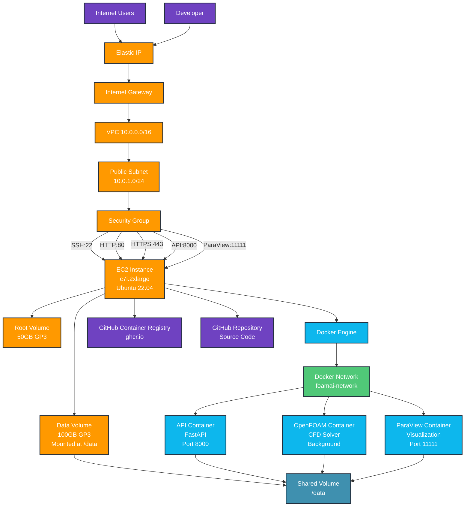

# FoamAI DevOps Guide

A comprehensive guide for deploying and managing the FoamAI CFD Assistant infrastructure on AWS.

## Table of Contents
- [Requirements](#requirements)
- [Environment Setup](#environment-setup)
- [Deployment Architecture](#deployment-architecture)
- [Deployment Pipeline](#deployment-pipeline)
- [User Data Script Architecture](#user-data-script-architecture)
- [Deployment Commands](#deployment-commands)
- [Monitoring & Maintenance](#monitoring--maintenance)
- [Troubleshooting](#troubleshooting)

## Requirements

### Software Dependencies

| Tool | Version | Purpose | Installation |
|------|---------|---------|--------------|
| **Terraform** | ≥ 1.8 | Infrastructure as Code | `brew install terraform` or [Download](https://developer.hashicorp.com/terraform/downloads) |
| **AWS CLI** | ≥ 2.0 | AWS service management | `brew install awscli` or [Install Guide](https://docs.aws.amazon.com/cli/latest/userguide/getting-started-install.html) |
| **Docker** | ≥ 20.10 | Container runtime | [Docker Desktop](https://www.docker.com/products/docker-desktop/) |
| **Git** | ≥ 2.0 | Version control | `brew install git` |
| **SSH** | Any | Server access | Pre-installed on most systems |

### AWS Prerequisites

#### 1. AWS Account Setup
- Active AWS account with billing enabled
- Programmatic access enabled

#### 2. IAM User Configuration
Create an IAM user with the following permissions:
```json
{
  "Version": "2012-10-17",
  "Statement": [
    {
      "Effect": "Allow",
      "Action": [
        "ec2:*",
        "iam:PassRole",
        "iam:CreateInstanceProfile",
        "iam:CreateRole",
        "iam:AttachRolePolicy"
      ],
      "Resource": "*"
    }
  ]
}
```

#### 3. SSH Key Pair
Generate an SSH key pair for EC2 access:
```bash
ssh-keygen -t ed25519 -f ~/.ssh/foamai-key -C "your-email@example.com"
```

#### 4. Enhanced IAM Permissions
For full console and deployment access, your IAM user needs comprehensive permissions. Here are two policy options:

**Minimal Console Access** (for basic AWS console access):
- EC2 read access across all regions
- Cost and Usage reporting access
- Security Hub read access

**Full DevOps Access** (for complete FoamAI deployment):
- All minimal access permissions
- EC2 instance management (create, modify, terminate)
- VPC and networking management
- EBS volume management
- Security group configuration
- ECR (Elastic Container Registry) access

Create custom IAM policies with these permissions and attach to your user account. See the IAM Setup Guide for detailed policy JSON and step-by-step instructions.

### Compute Requirements

#### Instance Types
| Environment | Instance Type | vCPUs | Memory | Storage | Use Case |
|-------------|---------------|-------|--------|---------|----------|
| **Development** | `c6i.large` | 2 | 4 GB | 30GB + 50GB | Testing & dev work |
| **MVP/Demo** | `c7i.2xlarge` | 8 | 16 GB | 50GB + 100GB | Production demos |
| **Production** | `c7i.4xlarge` | 16 | 32 GB | 100GB + 500GB | Full production load |

#### Storage Configuration
- **Root Volume**: OS, Docker images, applications
- **Data Volume**: CFD simulations, results, ParaView files
- **Network**: 25 Gbps network performance (c7i instances)

## Environment Setup

### 1. AWS Credentials Configuration

Create and configure AWS credentials using `.env` file approach:

#### Create `.env` file:
```bash
# Copy the example template
cp infra/terraform.tfvars.example infra/terraform.tfvars

# Create AWS credentials file
cat > ~/.aws/credentials << EOF
[default]
aws_access_key_id = YOUR_ACCESS_KEY_ID
aws_secret_access_key = YOUR_SECRET_ACCESS_KEY
region = us-east-1
EOF
```

#### Environment Variables Setup:
```bash
# Set environment variables for deployment
export AWS_REGION="us-east-1"
export AWS_PROFILE="default"
export TF_VAR_key_name="foamai-key"
export TF_VAR_public_key_content="$(cat ~/.ssh/foamai-key.pub)"
```

### 2. Terraform Configuration

Edit `infra/terraform.tfvars` with your specific values:

```hcl
# AWS Configuration
aws_region = "us-east-1"
instance_type = "c7i.2xlarge"

# SSH Key Configuration
key_name = "foamai-key"
public_key_content = "ssh-ed25519 AAAAC3NzaC1lZDI1NTE5AAAA... your-email@example.com"

# Storage Configuration  
root_volume_size = 50   # GB
data_volume_size = 100  # GB

# Project Settings
project_name = "FoamAI"
environment = "mvp"

# Security Configuration
allowed_ssh_cidrs = ["YOUR.IP.ADDRESS/32"]  # Restrict to your IP

# GitHub Configuration
github_org = "bbaserdem"
```

### 3. Docker Hub / GitHub Container Registry

Configure container registry access:

```bash
# For GitHub Container Registry (recommended)
echo $GITHUB_TOKEN | docker login ghcr.io -u USERNAME --password-stdin

# Environment variables for image URLs
export GHCR_API_URL="ghcr.io/bbaserdem/foamai/api"
export GHCR_OPENFOAM_URL="ghcr.io/bbaserdem/foamai/openfoam"
export GHCR_PVSERVER_URL="ghcr.io/bbaserdem/foamai/pvserver"
```

## Deployment Architecture

### Infrastructure Overview



### Service Architecture

| Service | Image | Port | Purpose | Health Check |
|---------|-------|------|---------|--------------|
| **API** | `ghcr.io/bbaserdem/foamai/api:latest` | 8000 | FastAPI backend, CFD operations | HTTP `/ping` endpoint |
| **OpenFOAM** | `ghcr.io/bbaserdem/foamai/openfoam:latest` | Internal | CFD computation engine | Configuration validation |
| **ParaView** | `ghcr.io/bbaserdem/foamai/pvserver:latest` | 11111 | Visualization server | Process monitoring |

## Deployment Pipeline

### Complete CI/CD Pipeline Flow

```mermaid
flowchart TD
    %% Development Phase
    A[Developer Commits Code] --> B[Push to GitHub Repository]
    B --> C{Branch Type?}
    
    %% CI/CD Branch Logic
    C -->|main/master| D[GitHub Actions Triggers]
    C -->|feature/PR| E[GitHub Actions<br/>Build Only<br/>No Deploy]
    
    %% GitHub Actions CI/CD Phase
    D --> F[Checkout Repository]
    F --> G[Set up Docker Buildx]
    G --> H[Login to GHCR<br/>ghcr.io]
    H --> I[Build Matrix Strategy<br/>3 Services Parallel]
    
    %% Service Building
    I --> J1[Build OpenFOAM<br/>docker/openfoam/]
    I --> J2[Build API<br/>docker/api/]
    I --> J3[Build ParaView Server<br/>docker/pvserver/]
    
    %% Image Publishing
    J1 --> K1[Push to GHCR<br/>ghcr.io/bbaserdem/foamai/openfoam:latest]
    J2 --> K2[Push to GHCR<br/>ghcr.io/bbaserdem/foamai/api:latest]
    J3 --> K3[Push to GHCR<br/>ghcr.io/bbaserdem/foamai/pvserver:latest]
    
    %% Security & Summary
    K1 --> L[Security Scan<br/>Trivy Vulnerability Check]
    K2 --> L
    K3 --> L
    L --> M[Build Summary<br/>GitHub Actions Report]
    
    %% Infrastructure Phase
    M --> N{Infrastructure<br/>Ready?}
    N -->|No| O[Deploy Infrastructure<br/>Terraform Apply]
    N -->|Yes| P[Use Existing<br/>Infrastructure]
    
    %% Terraform Infrastructure Setup
    O --> O1[Create VPC & Networking<br/>us-east-1]
    O1 --> O2[Launch EC2 Instance<br/>c7i.2xlarge Ubuntu 22.04]
    O2 --> O3[Attach EBS Volumes<br/>Root: 50GB, Data: 100GB]
    O3 --> O4[Configure Security Groups<br/>SSH:22, HTTP:80, HTTPS:443<br/>API:8000, ParaView:11111]
    O4 --> O5[Assign Elastic IP]
    O5 --> P
    
    %% EC2 Bootstrap Phase
    P --> Q[EC2 User Data Script<br/>Executes on Boot]
    Q --> Q1[Update System Packages<br/>apt-get update & upgrade]
    Q1 --> Q2[Install Docker & Docker Compose<br/>Latest Stable Versions]
    Q2 --> Q3[Setup Data Volume<br/>Mount EBS to /data]
    Q3 --> Q4[Clone Repository<br/>git clone foamai.git]
    Q4 --> Q5[Create Environment Config<br/>.env with GHCR URLs]
    Q5 --> Q6[Create systemd Service<br/>foamai.service]
    
    %% Application Deployment Phase
    Q6 --> R[Pull Docker Images<br/>from GitHub Container Registry]
    R --> R1[docker-compose pull<br/>openfoam, api, pvserver]
    R1 --> S[Start Services<br/>docker-compose up -d]
    
    %% Service Orchestration
    S --> S1[Start API Service<br/>Port 8000]
    S --> S2[Start OpenFOAM Service<br/>Compute Engine]
    S --> S3[Start ParaView Server<br/>Port 11111]
    
    %% Health Checks & Monitoring
    S1 --> T1[API Health Check<br/>curl localhost:8000/ping]
    S2 --> T2[OpenFOAM Health Check<br/>bashrc validation]
    S3 --> T3[ParaView Health Check<br/>process monitoring]
    
    %% Live System
    T1 --> U[Live Deployment Ready!]
    T2 --> U
    T3 --> U
    
    %% Operational Phase
    U --> V1[API Endpoints<br/>http://IP:8000<br/>http://IP:8000/docs]
    U --> V2[ParaView Visualization<br/>connect to IP:11111]
    U --> V3[Shared Data Volume<br/>/data for simulations]
    
    %% Status & Monitoring
    U --> W[Status Monitoring<br/>foamai-status script]
    W --> X[Log Monitoring<br/>startup & container logs]
    
    %% Update Cycle
    U --> Y{New Code<br/>Changes?}
    Y -->|Yes| A
    Y -->|No| U
    
    %% Styling
    classDef devPhase fill:#e1f5fe
    classDef ciPhase fill:#f3e5f5
    classDef infraPhase fill:#fff3e0
    classDef deployPhase fill:#e8f5e8
    classDef livePhase fill:#fff8e1
    
    class A,B,C devPhase
    class D,E,F,G,H,I,J1,J2,J3,K1,K2,K3,L,M ciPhase
    class N,O,O1,O2,O3,O4,O5,P infraPhase
    class Q,Q1,Q2,Q3,Q4,Q5,Q6,R,R1,S,S1,S2,S3,T1,T2,T3 deployPhase
    class U,V1,V2,V3,W,X,Y livePhase
```



## User Data Script Architecture

The deployment uses a modular, self-contained user data script that executes on EC2 boot. Here's the detailed flow:

### User Data Script Execution Flow

```mermaid
flowchart TD
    %% Script Initialization
    A[EC2 Boot Triggers user_data.sh] --> B[Initialize Logging System]
    B --> C[Export Configuration Variables]
    C --> D[Pre-flight Checks]
    
    %% Pre-flight Checks
    D --> D1{Root User?}
    D1 -->|No| ERR1[❌ ERROR: Must run as root]
    D1 -->|Yes| D2{Ubuntu User Exists?}
    D2 -->|No| ERR2[❌ ERROR: Ubuntu user missing]
    D2 -->|Yes| D3{Network Connectivity?}
    D3 -->|No| ERR3[❌ ERROR: No network]
    D3 -->|Yes| D4{Sufficient Disk Space?}
    D4 -->|No| ERR4[❌ ERROR: Low disk space]
    D4 -->|Yes| E[✅ Pre-flight Checks Pass]
    
    %% Module 1: System Update
    E --> M1[📦 Module 1: System Update]
    M1 --> M1A[Update Package Lists<br/>apt-get update]
    M1A --> M1B[Upgrade System Packages<br/>DEBIAN_FRONTEND=noninteractive]
    M1B --> M1C[Install Essential Packages<br/>curl, wget, git, jq, etc.]
    M1C --> M1D[Retrieve AWS Metadata<br/>region, instance-id, instance-type]
    M1D --> M1E{Module 1<br/>Success?}
    M1E -->|No| ERR_M1[❌ System Update Failed]
    M1E -->|Yes| M2[✅ Module 1 Complete]
    
    %% Module 2: Docker Setup
    M2 --> M2_START[🐳 Module 2: Docker Setup]
    M2_START --> M2A{Docker Already<br/>Installed?}
    M2A -->|Yes| M2F[Log Current Version]
    M2A -->|No| M2B[Add Docker GPG Key]
    M2B --> M2C[Add Docker Repository]
    M2C --> M2D[Install Docker CE<br/>+ Docker Compose]
    M2D --> M2E[Start & Enable Service]
    M2E --> M2F
    M2F --> M2G[Add ubuntu to docker group<br/>usermod -aG docker ubuntu]
    M2G --> M2H[Install Docker Compose Standalone]
    M2H --> M2I{Module 2<br/>Success?}
    M2I -->|No| ERR_M2[❌ Docker Setup Failed]
    M2I -->|Yes| M3[✅ Module 2 Complete]
    
    %% Module 3: EBS Volume Setup
    M3 --> M3_START[💾 Module 3: EBS Volume Setup]
    M3_START --> M3A[Wait for EBS Volumes<br/>timeout: 300s]
    M3A --> M3B{Volume Discovery<br/>Strategy}
    
    %% Volume Discovery Strategies
    M3B --> M3B1[Strategy 1: Size-based Discovery<br/>Find ${DATA_VOLUME_SIZE_GB}GB volume]
    M3B1 --> M3B2{Volume Found<br/>by Size?}
    M3B2 -->|Yes| M3C[Selected Device Found]
    M3B2 -->|No| M3B3[Strategy 2: Metadata Discovery<br/>Check AWS block device mapping]
    M3B3 --> M3B4{Volume Found<br/>by Metadata?}
    M3B4 -->|Yes| M3C
    M3B4 -->|No| M3B5[Strategy 3: Unused Device<br/>Find unmounted device]
    M3B5 --> M3B6{Unused Device<br/>Found?}
    M3B6 -->|Yes| M3C
    M3B6 -->|No| M3D[Fallback: Use Root Volume<br/>Create /data directory]
    
    M3C --> M3E{Device Has<br/>Filesystem?}
    M3E -->|No| M3F[Create ext4 Filesystem<br/>mkfs.ext4 -F]
    M3E -->|Yes| M3G[Mount to /data]
    M3F --> M3G
    M3G --> M3H[Add UUID to /etc/fstab<br/>Persistent mounting]
    M3H --> M3I[Set Permissions<br/>chown ubuntu:ubuntu]
    M3I --> M3J{Module 3<br/>Success?}
    M3J -->|No| ERR_M3[❌ Volume Setup Failed]
    M3J -->|Yes| M4[✅ Module 3 Complete]
    M3D --> M4
    
    %% Module 4: Application Setup
    M4 --> M4_START[🚀 Module 4: Application Setup]
    M4_START --> M4A[Create Install Directory<br/>/opt/FoamAI]
    M4A --> M4B{Repository<br/>Exists?}
    M4B -->|Yes| M4C[git pull origin main]
    M4B -->|No| M4D[git clone FoamAI repo]
    M4C --> M4E[Verify Repository Structure<br/>Check docker-compose.yml]
    M4D --> M4E
    M4E --> M4F[Create Environment Config<br/>Generate .env file]
    M4F --> M4G[Setup Data Directories<br/>simulations, results, meshes]
    M4G --> M4H{Module 4<br/>Success?}
    M4H -->|No| ERR_M4[❌ Application Setup Failed]
    M4H -->|Yes| M5[✅ Module 4 Complete]
    
    %% Module 5: Service Setup
    M5 --> M5_START[⚙️ Module 5: Service Setup]
    M5_START --> M5A[Create systemd Service<br/>/etc/systemd/system/foamai.service]
    M5A --> M5B[Create Status Script<br/>/usr/local/bin/foamai-status]
    M5B --> M5C[Setup Log Rotation<br/>/etc/logrotate.d/docker-containers]
    M5C --> M5D[Enable systemd Service<br/>systemctl enable foamai]
    M5D --> M5E{Module 5<br/>Success?}
    M5E -->|No| ERR_M5[❌ Service Setup Failed]
    M5E -->|Yes| M6[✅ Module 5 Complete]
    
    %% Module 6: Docker Operations
    M6 --> M6_START[🔄 Module 6: Docker Operations]
    M6_START --> M6A[Wait for Docker Ready<br/>timeout: 60s]
    M6A --> M6B[Validate docker-compose.yml]
    M6B --> M6C[Pull Docker Images<br/>API, OpenFOAM, ParaView]
    M6C --> M6D[Start Services<br/>docker-compose up -d]
    M6D --> M6E[Wait for Services Ready<br/>30s startup time]
    M6E --> M6F[Test API Endpoint<br/>curl localhost:8000/ping]
    M6F --> M6G[Start systemd Service<br/>systemctl start foamai]
    M6G --> M6H{Module 6<br/>Success?}
    M6H -->|No| ERR_M6[❌ Docker Operations Failed]
    M6H -->|Yes| POST[✅ Module 6 Complete]
    
    %% Post-deployment Validation
    POST --> V1[🔍 Post-deployment Validation]
    V1 --> V1A{Docker Service<br/>Running?}
    V1A -->|No| ERR_V1[❌ Docker Service Down]
    V1A -->|Yes| V1B{FoamAI Service<br/>Running?}
    V1B -->|No| ERR_V2[❌ FoamAI Service Down]
    V1B -->|Yes| V1C{Data Directory<br/>Accessible?}
    V1C -->|No| ERR_V3[❌ Data Directory Issue]
    V1C -->|Yes| SUMMARY[✅ Validation Complete]
    
    %% Success Path
    SUMMARY --> SUCCESS[🎉 Deployment Summary]
    SUCCESS --> SUCCESS_A[Log Service Endpoints<br/>API: http://IP:8000<br/>ParaView: IP:11111]
    SUCCESS_A --> SUCCESS_B[Create Completion Marker<br/>/var/log/foamai-startup-complete]
    SUCCESS_B --> DONE[🏁 DEPLOYMENT SUCCESSFUL]
    
    %% Error Handling
    ERR1 --> FAIL[💥 DEPLOYMENT FAILED]
    ERR2 --> FAIL
    ERR3 --> FAIL
    ERR4 --> FAIL
    ERR_M1 --> FAIL
    ERR_M2 --> FAIL
    ERR_M3 --> FAIL
    ERR_M4 --> FAIL
    ERR_M5 --> FAIL
    ERR_M6 --> FAIL
    ERR_V1 --> FAIL
    ERR_V2 --> FAIL
    ERR_V3 --> FAIL
    
    FAIL --> FAIL_A[Generate Failure Report<br/>/var/log/foamai-deployment-failure.log]
    FAIL_A --> FAIL_B[Log Error Details & Diagnostics]
    
    %% Styling
    classDef initPhase fill:#e3f2fd
    classDef modulePhase fill:#e8f5e8
    classDef errorPhase fill:#ffebee
    classDef successPhase fill:#f1f8e9
    classDef validationPhase fill:#fff3e0
    
    class A,B,C,D,D1,D2,D3,D4,E initPhase
    class M1,M1A,M1B,M1C,M1D,M1E,M2,M2_START,M2A,M2B,M2C,M2D,M2E,M2F,M2G,M2H,M2I,M3,M3_START,M3A,M3B,M3B1,M3B2,M3B3,M3B4,M3B5,M3B6,M3C,M3D,M3E,M3F,M3G,M3H,M3I,M3J,M4,M4_START,M4A,M4B,M4C,M4D,M4E,M4F,M4G,M4H,M5,M5_START,M5A,M5B,M5C,M5D,M5E,M6,M6_START,M6A,M6B,M6C,M6D,M6E,M6F,M6G,M6H,POST modulePhase
    class ERR1,ERR2,ERR3,ERR4,ERR_M1,ERR_M2,ERR_M3,ERR_M4,ERR_M5,ERR_M6,ERR_V1,ERR_V2,ERR_V3,FAIL,FAIL_A,FAIL_B errorPhase
    class SUCCESS,SUCCESS_A,SUCCESS_B,DONE successPhase
    class V1,V1A,V1B,V1C,SUMMARY validationPhase
```

### Module Details

#### Module 1: System Update
- **Purpose**: Prepare the system with latest packages and AWS metadata
- **Key Operations**:
  - Update package lists with retry logic
  - Install essential packages (curl, wget, git, jq, etc.)
  - Retrieve AWS instance metadata (region, instance-id, instance-type)
  - Validate network connectivity

#### Module 2: Docker Setup  
- **Purpose**: Install Docker and Docker Compose
- **Key Operations**:
  - Add Docker's official GPG key and repository
  - Install Docker CE, CLI, containerd, and buildx plugin
  - Configure Docker daemon and enable service
  - Add ubuntu user to docker group with immediate activation
  - Install standalone Docker Compose

#### Module 3: EBS Volume Setup
- **Purpose**: Mount additional EBS storage for CFD data
- **Discovery Strategies**:
  1. **Size-based**: Find volume matching configured size (most reliable)
  2. **Metadata-based**: Use AWS block device mapping
  3. **Unused device**: Find unmounted block devices
- **Key Operations**:
  - Create ext4 filesystem if needed
  - Mount to `/data` with UUID-based fstab entry
  - Set proper permissions for ubuntu user

#### Module 4: Application Setup
- **Purpose**: Clone repository and configure application
- **Key Operations**:
  - Clone FoamAI repository to `/opt/FoamAI`
  - Generate `.env` file with GitHub Container Registry URLs
  - Create data directory structure (simulations, results, meshes)
  - Set proper file permissions

#### Module 5: Service Setup
- **Purpose**: Create systemd services and monitoring
- **Key Operations**:
  - Create `foamai.service` systemd unit file
  - Install `foamai-status` monitoring script
  - Configure log rotation for Docker containers
  - Enable service for automatic startup

#### Module 6: Docker Operations
- **Purpose**: Pull images and start services
- **Key Operations**:
  - Wait for Docker daemon readiness
  - Pull container images from GitHub Container Registry
  - Start services with `docker-compose up -d`
  - Validate service health and API endpoints
  - Start systemd service

## Deployment Commands

### Initial Infrastructure Deployment

```bash
# 1. Navigate to infrastructure directory
cd infra

# 2. Initialize Terraform
terraform init

# 3. Validate configuration
terraform validate
terraform fmt -check

# 4. Plan deployment (review changes)
terraform plan -var-file="terraform.tfvars"

# 5. Deploy infrastructure
terraform apply -var-file="terraform.tfvars"

# 6. Get instance IP for SSH access
terraform output instance_public_ip
```

### SSH Access and Validation

```bash
# Get the instance IP from Terraform output
INSTANCE_IP=$(terraform output -raw instance_public_ip)

# SSH into the instance
ssh -i ~/.ssh/foamai-key ubuntu@$INSTANCE_IP

# Check deployment status
sudo foamai-status

# View deployment logs
sudo tail -f /var/log/foamai-startup.log

# Check if deployment completed
ls -la /var/log/foamai-startup-complete
```

### Application Updates

```bash
# On the EC2 instance - update to latest images
cd /opt/FoamAI
sudo docker-compose pull
sudo docker-compose up -d

# Or restart the systemd service
sudo systemctl restart foamai
```

### Infrastructure Updates

```bash
# Apply infrastructure changes
cd infra
terraform plan -var-file="terraform.tfvars"
terraform apply -var-file="terraform.tfvars"

# Force instance recreation (if needed)
terraform apply -replace="aws_instance.foamai_instance"
```

### Cleanup and Destruction

```bash
# Destroy all infrastructure
cd infra
terraform destroy -var-file="terraform.tfvars"

# Or destroy specific resources
terraform destroy -target="aws_instance.foamai_instance"
```

## Monitoring & Maintenance

### Service Health Monitoring

```bash
# Check overall system status
sudo foamai-status

# Check individual services
systemctl status docker
systemctl status foamai
docker ps
docker-compose ps

# View service logs
docker-compose logs -f api
docker-compose logs -f openfoam  
docker-compose logs -f pvserver
```

### Log Files Location

| Log File | Purpose | Location |
|----------|---------|----------|
| **Startup Log** | Deployment script execution | `/var/log/foamai-startup.log` |
| **Deployment Summary** | Successful deployment info | `/var/log/foamai-deployment-summary.log` |
| **Failure Report** | Error details if deployment fails | `/var/log/foamai-deployment-failure.log` |
| **Container Logs** | Docker container output | `docker-compose logs [service]` |
| **System Logs** | Ubuntu system logs | `/var/log/syslog` |

### Performance Monitoring

```bash
# System resources
htop
iostat -x 1
free -h
df -h

# Container resources
docker stats
docker system df

# Network monitoring  
netstat -tulpn
ss -tulpn
```

### Backup and Snapshots

```bash
# Create EBS snapshots (manual)
aws ec2 create-snapshot \
  --volume-id vol-xxxxxxxxx \
  --description "FoamAI data backup $(date)" \
  --region us-east-1

# List existing snapshots
aws ec2 describe-snapshots \
  --owner-ids self \
  --region us-east-1
```

## Troubleshooting

### Common Issues and Solutions

#### 1. EBS Volume Mount Issues
**Symptoms**: `/data` directory not available, services can't write files
```bash
# Check volume attachment
lsblk
df -h

# Check volume discovery logs
sudo grep -A 10 -B 10 "volume" /var/log/foamai-startup.log

# Manual mount (if needed)
sudo mount /dev/nvme1n1 /data
```

#### 2. Docker Permission Issues  
**Symptoms**: `permission denied` errors when running docker commands
```bash
# Check docker group membership
groups ubuntu

# Add user to docker group (if missing)
sudo usermod -aG docker ubuntu

# Restart docker service
sudo systemctl restart docker

# Test docker access
sudo -u ubuntu docker ps
```

#### 3. Container Image Pull Failures
**Symptoms**: Images fail to download, containers don't start
```bash
# Check network connectivity
ping 8.8.8.8
curl -I https://ghcr.io

# Manual image pull
docker pull ghcr.io/bbaserdem/foamai/api:latest

# Check GitHub Container Registry authentication
docker login ghcr.io
```

#### 4. API Service Not Responding
**Symptoms**: Cannot access API endpoints, health checks fail
```bash
# Check API container status
docker ps | grep api
docker logs foamai-api

# Test API locally on instance
curl http://localhost:8000/ping

# Check network configuration
netstat -tulpn | grep 8000
```

#### 5. ParaView Connection Issues
**Symptoms**: Cannot connect to ParaView server from client
```bash
# Check ParaView container
docker ps | grep pvserver
docker logs foamai-pvserver

# Check port accessibility
netstat -tulpn | grep 11111
telnet $INSTANCE_IP 11111
```

### Debug Mode Deployment

For troubleshooting deployment issues, enable debug mode:

```bash
# Redeploy with debug logging
terraform apply -var-file="terraform.tfvars" -replace="aws_instance.foamai_instance"

# SSH and check detailed logs
ssh -i ~/.ssh/foamai-key ubuntu@$INSTANCE_IP
sudo grep -i debug /var/log/foamai-startup.log
```

### Manual Service Recovery

```bash
# Stop all services
sudo systemctl stop foamai
sudo docker-compose down

# Clean up containers and networks
sudo docker system prune -f
sudo docker network prune -f

# Restart from clean state
cd /opt/FoamAI
sudo docker-compose pull
sudo docker-compose up -d
sudo systemctl start foamai
```

### Emergency Procedures

#### Complete System Recovery
```bash
# If all else fails, recreate instance
cd infra
terraform destroy -target="aws_instance.foamai_instance"
terraform apply -var-file="terraform.tfvars"
```

#### Data Recovery
```bash
# Mount data volume to new instance
# (EBS volumes persist beyond instance lifecycle)
aws ec2 describe-volumes --region us-east-1
aws ec2 attach-volume --volume-id vol-xxxxx --instance-id i-xxxxx --device /dev/sdf
```

## Advanced Configuration

### EBS Volume Configuration Details

The deployment supports flexible EBS volume configuration with multiple discovery strategies:

#### Volume Discovery Strategies
1. **Size-based Discovery** (Most Flexible)
   - Searches for devices matching expected size (±10% tolerance)
   - Works regardless of device naming conventions
   - Handles filesystem overhead calculations

2. **AWS Metadata-based Discovery** (Most Authoritative)
   - Uses AWS instance metadata for definitive device mapping
   - Requires AWS CLI availability
   - Provides authoritative device identification

3. **Unused Device Discovery** (Fallback)
   - Finds unformatted, unmounted devices
   - Validates against root device to prevent conflicts
   - Last resort for edge cases

#### Configuration Variables
| Variable | Default | Description |
|----------|---------|-------------|
| `data_volume_size` | 100 | Size of EBS data volume in GB |
| `data_volume_filesystem` | ext4 | Filesystem type (ext4, xfs) |
| `data_volume_mount_point` | /data | Mount point for data volume |
| `ebs_wait_timeout` | 300 | Timeout for volume detection (seconds) |

#### Deployment Profiles
- **minimal**: Small volume, basic setup (testing/development)
- **standard**: Current default configuration (production workloads)
- **performance**: Optimized for high-performance (heavy CFD simulations)
- **development**: Development-specific settings

### Local Development Workflow

For local testing before deployment:

```bash
# 1. Install and configure tools
terraform --version  # Ensure ≥ 1.8
aws configure        # Set up credentials

# 2. Set up local backend
cd infra
terraform init

# 3. Validate configuration
terraform fmt -check
terraform validate
terraform plan -var-file="terraform.tfvars"

# 4. Deploy and test
terraform apply -var-file="terraform.tfvars"

# 5. SSH and verify
ssh ubuntu@$(terraform output -raw instance_public_ip)
docker ps  # Confirm services running

# 6. Clean up when done
terraform destroy -var-file="terraform.tfvars"
```

#### Quick Iteration Options
| Task | Command |
|------|---------|
| Test user-data script only | `terraform apply -replace="aws_instance.foamai_instance"` |
| Test single resource | `terraform apply -target=aws_security_group.foamai_sg` |
| Test new variables | Edit `terraform.tfvars`, run `terraform plan` |

---

*This guide provides comprehensive coverage of FoamAI's DevOps workflow. For additional support, refer to the individual module documentation, Contributing.md for development setup, or check the project's GitHub issues.*